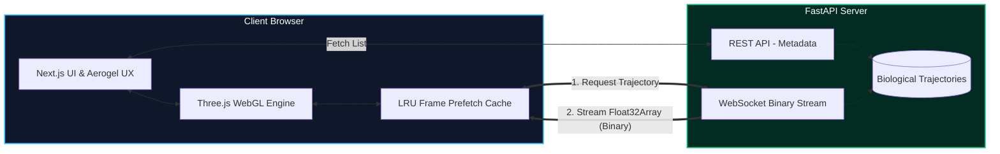

<div align="center">
  
# 🧬 WebVMD: Molecular Dynamics in the Browser
**A High-Performance Computational Biology Visualization Platform**

[](https://nextjs.org/)
[](https://threejs.org/)
[](https://fastapi.tiangolo.com/)
[](https://www.python.org/)
[](https://tailwindcss.com/)

</div>

---

## ⚡ Overview
**WebVMD** is a professional-grade, browser-native platform designed to stream and visualize large-scale molecular dynamics (MD) trajectories in real-time.

Historically, structural biologists and bioinformaticians have been tethered to heavy, legacy desktop applications (like the original VMD, PyMOL, or Chimera). These legacy tools often require complex local environment setups, massive computational overhead, and tedious manual downloading of gigabyte-sized `.dcd` or `.xtc` trajectory files.

By utilizing a modernized decoupled stack—pairing a highly concurrent Python FastAPI backend with a WebGL-powered React frontend—WebVMD fundamentally disrupts this workflow. It bypasses the limitations of localized compute by streaming topological data directly to the web browser. This enables butter-smooth, >60 FPS structural biology analysis on any modern device, completely democratizing access to high-performance computational models.

Through advanced spatial calculations, customized GPU memory allocations (`InstancedMesh`), and heavily optimized binary WebSockets, this platform is tailored to visualize and interrogate highly complex targets like GPCRs, Spike Protein complexes, and lipid bilayers without dropping frames.

---

## 🏗️ System Architecture
WebVMD utilizes a modernized decoupled monorepo approach, explicitly engineered to handle the massive data throughput required for temporal physics simulations:



### The Data Pipeline & Render Engine
* **Binary Serialization**: Instead of transmitting bloated JSON payloads over HTTP, the FastAPI backend parses raw trajectory coordinates and serializes them into highly compressed `Float32Array` binary chunks. This reduces network payload size by over 80% and allows the browser to write the data directly into GPU memory without costly JSON parsing overhead.
* **LRU Frame Caching**: The Next.js frontend implements a custom Least Recently Used (LRU) cache protocol. As the user watches the simulation, the engine proactively prefetches the next 50-100 frames via WebSocket, buffering them in memory to guarantee zero-stutter playback even during network latency spikes.
* **The requestAnimationFrame Loop**: Frame interpolation and camera movements are deeply integrated into the native browser refresh cycle, ensuring algorithmic gliding rather than jarring frame jumps.

---

## ✨ Enterprise-Grade Features

### 1. Dynamic GPU Scaling
Rendering biology in the browser typically crashes due to high draw-call volumes. WebVMD actively analyzes the incoming structural density to prevent this:
* **For standard compounds (< 50,000 atoms)**: The engine maps geometry using `InstancedMesh`. This allows the GPU to calculate the geometry of a single sphere once, and mathematically instance it thousands of times across the canvas with full lighting calculations.
* **For massive topologies (> 100,000 atoms)**: The engine intelligently drops down to high-performance GLSL `Points` mappings. This strips away complex geometry, replacing them with bare-metal vertex shader points, allowing smooth orbit controls on massive viral envelopes or water-box simulations.

### 2. Cinematic Shaders & Visuals
To rival professional cinematic rendering tools, WebVMD injects customized post-processing passes into the Three.js pipeline:
* **Screen-Space Ambient Occlusion (SSAO)**: Generates deep, realistic shadows in the crevices between atoms, drastically improving the human eye's ability to distinguish overlapping protein folds and secondary structures (alpha-helices, beta-sheets).
* **Responsive UnrealBloomPass**: Invokes volumetric, photorealistic glow mimicking modern high-end scientific modeling, perfect for highlighting active binding sites or highly electrostatic residues.

### 3. Domain-Specific Analysis Tooling
WebVMD moves beyond a simple "3D viewer" by embedding tools required for active pharmacological research:
* **Live RMSD Tracking**: Root-Mean-Square Deviation (RMSD) is the gold standard for measuring protein stability. WebVMD integrates an active SVG-based line chart that dynamically tracks and plots the simulated spatial deviation, natively reacting to the frame progression so researchers can pinpoint exactly when a protein undergoes a conformational change.
* **8Å Pocket Explorer**: Simulates a modern drug-binding workflow. With a single click, the algorithm calculates the spatial Euclidean distance from a selected active residue to all surrounding atoms. Everything beyond a functional 8-Angstrom radius is immediately hidden from the view matrix, stripping away solvent noise and isolating the exact pocket required for ligand docking.

### 4. "Aerogel" UX & Architecture
The interface abandons generic, bloated web designs in favor of a bespoke, laboratory-grade "Aerogel" glassmorphic interface. It utilizes CSS backdrop filter optimizations to create floating, semi-translucent control panels that overlay the 3D canvas without obscuring the scientific data. It feels less like a website, and more like clinical hardware.

---

## 🚀 Quickstart (Local Deployment)

### Prerequisites
* Node.js (v18.0 or higher)
* Python (v3.9 or higher)

### 1. Backend Setup
Initialize the high-performance inference and streaming server:
```bash
cd backend
python -m venv .venv
source .venv/bin/activate
pip install -r requirements.txt
uvicorn app.main:app --port 8000
```
*(Note: Upon the first runtime, the FastAPI server will automatically generate and cache 3 mock biological dataset simulations—including a simulated Kinase and a viral antibody complex—to ensure immediate testing availability).*

### 2. Frontend Setup
Open a new terminal window to spin up the Next.js/Three.js client:
```bash
cd frontend
npm install
npm run dev
```

### 3. Usage
1. Navigate to `http://localhost:3000` in your web browser.
2. Select a target dataset from the main dashboard.
3. Utilize the **Spacebar** to natively toggle trajectory playback, mimicking professional video editing software.
4. Use the **Left-Click** to Orbit, **Right-Click** to Pan, and **Scroll** to Zoom.
5. Click directly on any residue to highlight it and activate the Pocket Explorer.

---

## 👨‍💻 Author & Vision
This architecture was engineered to demonstrate a complete mastery over the intersection of software engineering and biophysics. Built to bridge the gap between high-performance computing, complex mathematical simulations, and intuitive, scalable user experiences in the modern Tech-Bio landscape.
