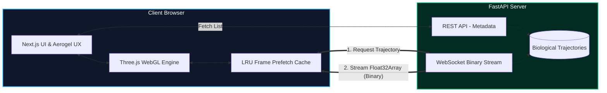

<div align="center">
  
# 🧬 WebVMD: Molecular Dynamics in the Browser
**A High-Performance Computational Biology Visualization Platform**

[](https://nextjs.org/)
[](https://threejs.org/)
[](https://fastapi.tiangolo.com/)
[](https://www.python.org/)
[](https://tailwindcss.com/)

</div>

---

## ⚡ Overview
**WebVMD** is a professional-grade, browser-native platform designed to stream and visualize large-scale molecular dynamics (MD) trajectories in real-time. By utilizing a decoupled stack with a Python FastAPI backend and a WebGL-powered React frontend, WebVMD bypasses the limitations of heavy, localized desktop scientific software, enabling butter-smooth, >60 FPS structural biology analysis directly natively in the web browser. 

Through advanced spatial calculations, customized `InstancedMesh` GPU memory allocations, and optimized binary WebSockets, this platform is tailored to visualize complex targets like GPCRs and Spike Protein complexes.

---

## 🏗️ System Architecture

WebVMD utilizes a modernized decoupled monorepo approach optimized for speed:



---

## ✨ Features

- **Dynamic GPU Scaling:** Automatically analyzes structural density, falling back from fully illuminated `InstancedMesh` spheres to high-performance GLSL `Points` mappings for giant multi-hundred-thousand atom topologies without losing frame rate.
- **Cinematic Shaders:** Injects customized rendering passes including Screen-Space Ambient Occlusion (SSAO) and responsive `UnrealBloomPass` volumetrics for photorealistic ligand visualization.
- **Domain-Specific Analysis Tooling:** 
  - **Live RMSD Tracking:** Data-Viz overlay predicting simulated spatial deviation dynamically synced to frame playback.
  - **8Å Pocket Explorer:** Instantaneous 3D spatial isolation of binding pockets natively simulating pharmacological drug-discovery configurations.
- **"Aerogel" UX:** Bespoke glassmorphic user interface controlled natively by CSS backdrop filter optimizations. 

---

## 🚀 Quickstart (Local Deployment)

### 1. Backend Setup
```bash
cd backend
python -m venv .venv
source .venv/bin/activate
pip install -r requirements.txt
uvicorn app.main:app --port 8000
```
*(Note: The backend will automatically generate 3 mock biological dataset simulations upon the first runtime).*

### 2. Frontend Setup
Open a new terminal window:
```bash
cd frontend
npm install
npm run dev
```

### 3. Usage
Navigate to `http://localhost:3000` in your browser. Select a target dataset and utilize **Spacebar** to toggle trajectory playbacks.

---

## 👨‍💻 Author
Built for modern computational biology engineering demonstration. 
